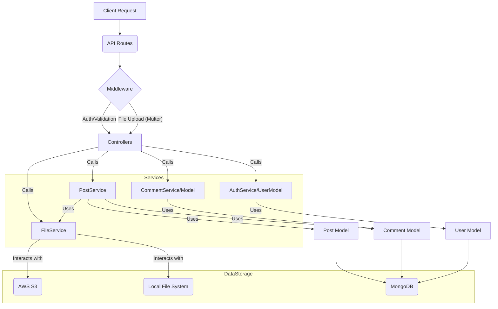

# Backend Refactoring and Optimization Plan

## 1. Current Architecture Overview

The backend is a Node.js/Express.js application using MongoDB for data storage. Key features include user authentication (JWT & Google OAuth), CRUD operations for blog posts with image uploads, comments, and post searching.

File uploads are handled with a dual strategy:
*   **AWS S3:** If AWS credentials and SDK are available. Multer-S3 is used for direct uploads.
*   **Local Storage:** Fallback if S3 is not configured. Multer saves files to an `uploads/` directory served statically.

The structure includes standard directories for routes, controllers, models, middlewares, and configuration.

## 2. Identified Issues and Areas for Improvement

*   **Complex File URL Management:** Logic for determining image URLs (S3 vs. local, placeholders) is scattered, particularly in `postController.js`. The existing `getPresignedUrl` in `s3Config.js` is not consistently used, leading to potential discrepancies and making the code harder to maintain.
*   **Lack of Abstraction for File Storage:** Controllers directly interact with S3 SDK specifics or local file paths, making them less focused on business logic and harder to test.
*   **Readability in Controllers:** `postController.js` has significant logic for handling file operations (upload, delete, URL generation) intertwined with request handling.
*   **Inconsistent Controller Imports:** Some routes use inline `require()` for controllers.
*   **Potential for Service Layer:** Business logic could be further decoupled from controllers by introducing service layers.
*   **Inconsistent Error Handling:** Some controllers (`commentController.js`) send error responses directly instead of using the centralized `errorMiddleware`.

## 3. Proposed New Architecture

The core idea is to introduce a **Service Layer**, particularly for file handling, to decouple storage concerns from controllers and centralize URL generation.

### 3.1. Key Components:

*   **`FileService` (New):**
    *   **Responsibilities:**
        *   Abstracting file uploads (S3 or local).
        *   Abstracting file deletions.
        *   Centralizing the generation of accessible file URLs (S3 public/presigned URLs or local static paths).
    *   **Methods:**
        *   `uploadFile(fileObjectFromMulter)`: Returns a unique file identifier (S3 key or local filename).
        *   `deleteFile(fileIdentifier)`: Deletes the file from the appropriate storage.
        *   `getFileUrl(fileIdentifier)`: Returns a publicly accessible URL for the file. Will incorporate placeholder logic.
*   **`PostService` (Potential Enhancement):**
    *   **Responsibilities:** Handle complex business logic related to posts, using `FileService` for cover images.
    *   **Methods (Examples):**
        *   `createPost(postData, authorId, fileObject)`
        *   `updatePost(postId, postData, userId, fileObject)`
        *   `deletePost(postId, userId)` (handles deleting post, cover image via `FileService`, and comments)
        *   `formatPostForOutput(postDocument)` (ensures cover URL is correctly generated using `FileService`)
*   **Controllers (`authController`, `postController`, `commentController`):**
    *   Slimmed down to primarily handle HTTP request/response and user input validation.
    *   Delegate business logic and data manipulation to services (`FileService`, `PostService`).
*   **`s3Config.js` / `uploadMiddleware`:**
    *   The `multer` setup might be slightly simplified, or `FileService` might directly use `multer` configured for S3/local. The `upload` middleware will still be used by routes to parse `multipart/form-data`.
    *   The `getPresignedUrl` logic will be absorbed and enhanced within `FileService.getFileUrl()`.
*   **Models, Routes, Middlewares:** Largely remain the same, but controllers will interact with services instead of directly with Mongoose models for complex operations or file system/S3 specifics.

### 3.2. Mermaid Diagram



## 4. Implementation Tasks

1.  **Create `plan.md`:** Document the current state, proposed changes, and this task list. (This document)
2.  **Develop `FileService`:**
    *   Create `api/services/fileService.js`.
    *   Implement `uploadFile(file)`:
        *   This method will likely be simple if `multer` in `s3Config.js` (or a new dedicated upload middleware) still handles the actual upload. This service method might just return the `file.location` (S3) or `file.filename` (local).
        *   Alternatively, `FileService` could invoke `multer` programmatically if needed, but using it as middleware is standard.
    *   Implement `deleteFile(fileIdentifier)`:
        *   Takes an S3 key or local filename.
        *   Uses `s3Client.send(new DeleteObjectCommand(...))` for S3.
        *   Uses `fs.promises.unlink` for local files.
        *   Integrates `hasValidAwsCredentials` logic from `s3Config.js`.
    *   Implement `getFileUrl(fileIdentifier)`:
        *   Absorb and refine logic from `s3Config.js#getPresignedUrl`.
        *   Handle placeholder images (e.g., `DEFAULT_PLACEHOLDER_IMAGE`).
        *   Return correct S3 URL (public or presigned based on bucket policy, though current code implies public or needs presigning) or local static path (`/api/uploads/...`).
3.  **Refactor `s3Config.js`:**
    *   Simplify or remove `getPresignedUrl` if its logic is fully moved to `FileService`.
    *   Ensure the `upload` (multer instance) is configured to provide necessary file info (like `location` for S3, `filename` for local) that `FileService` can use.
4.  **Refactor `postController.js`:**
    *   Inject/import `FileService`.
    *   **`createPost`**:
        *   Use `FileService.getFileUrl(req.file ? req.file.key || req.file.filename : null)` or similar to store the canonical URL or just store the key/filename and generate URL on read. Storing key/filename is often better. Let's assume storing key/filename. `cover: req.file ? (req.file.key || req.file.filename) : null`.
        *   The `coverUrl` for the response will be generated via `FileService.getFileUrl()`.
    *   **`updatePost`**:
        *   If a new file is uploaded, delete the old one using `FileService.deleteFile(postDoc.cover)` before updating `postDoc.cover` with the new key/filename.
        *   Update `postDoc.cover` with the new file's key or filename.
    *   **`getPosts`, `getPostsByUser`, `getPostById`, `searchPosts`**:
        *   For each post, transform `post.cover` (which is now a key/filename) into a full URL using `FileService.getFileUrl(post.cover)`. This can be done via a helper function or if a `PostService` is introduced, it can handle this transformation.
5.  **Refactor `commentController.js`:**
    *   Ensure all error handling paths use `next(error)` instead of `res.status().json()`.
6.  **Refactor `postRoutes.js`:**
    *   Change inline `require()` for controllers to standard `import` or `require` at the top of the file.
7.  **(Optional but Recommended) Develop `PostService`:**
    *   Create `api/services/postService.js`.
    *   Move complex post-related logic here (e.g., creating a post including file handling via `FileService`, full deletion logic).
    *   Controllers would then call `PostService`.
8.  **Testing and Validation:**
    *   Thoroughly test all API endpoints, especially post creation, update, deletion, and retrieval, ensuring images work correctly with both S3 and local storage configurations.
    *   Test authentication and comment functionalities.
9.  **Submit Changes:** Commit the refactored code with a clear message.
```
