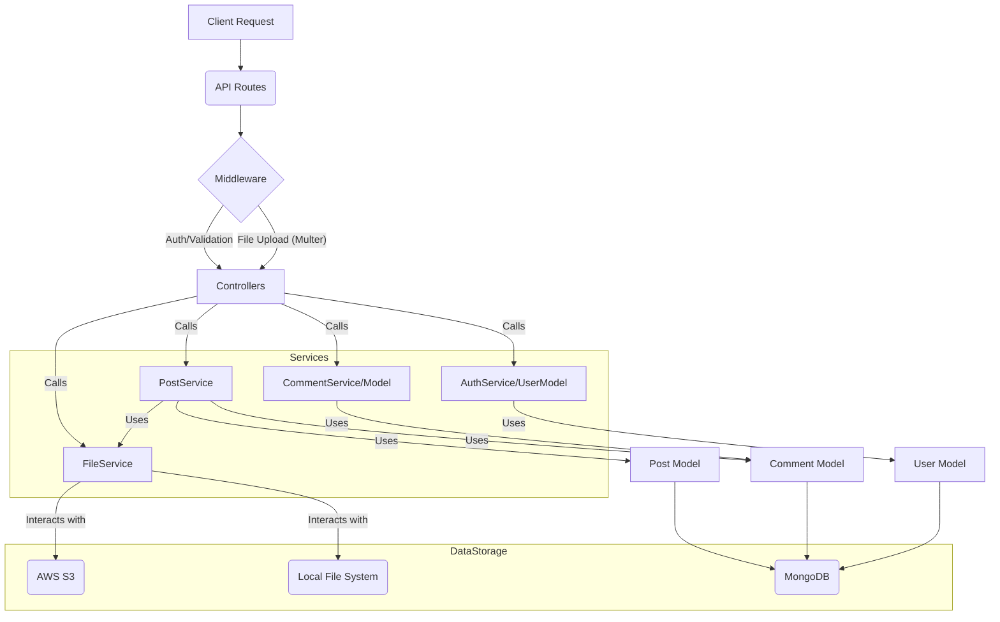

# Backend Architecture Comparison: `api` vs. `api2`

This document compares two backend architectures for the Blogify API: the existing `api` architecture and the proposed `api2` architecture. The goal is to evaluate their strengths and weaknesses to determine which provides a more robust, maintainable, and scalable solution.

## 1. Current Architecture (`api`)

The `api` architecture is a Node.js/Express.js application utilizing MongoDB. It follows a layered approach with dedicated directories for routes, controllers, services, external integrations, models, middlewares, and utilities. The refactoring plan for this architecture emphasized principles like Single Responsibility Principle (SRP), Don't Repeat Yourself (DRY), and Separation of Concerns.

### `api` Architecture Diagram

```mermaid
graph TD
    A[Client Request] --> B(Express Router);
    B --> C{Validation Middleware};
    C -- Valid --> D{Authentication Middleware};
    D -- Authenticated --> E[Controller];
    E --> F[Service Layer];
    F --> G[Model (Mongoose)];
    F --> H[External Services (S3, Google OAuth)];
    F --> I[Utility/Helper Functions];

    G -- Data Access --> F;
    H -- API Calls --> F;
    I -- Common Logic --> F;
    F -- Business Logic --> E;
    E -- Response --> B;
    B -- Response --> A;
```

### Pros of `api` Architecture:

*   **Clear Separation of Concerns:** The architecture demonstrates a good separation of concerns with distinct layers for services (business logic), external integrations (S3, Google OAuth), and error handling.
*   **Enhanced Error Handling:** It implements custom error classes (`ApiError`, `AuthError`, `NotFoundError`, `ValidationError`) and a robust `errorMiddleware` that intelligently handles various error types, providing consistent and informative responses to the client.
*   **Google OAuth Abstraction:** The Google OAuth logic is well-encapsulated within `api/external/googleAuthService.js`, making it reusable, testable, and easier to manage.
*   **S3 Service Abstraction:** S3 operations (upload, presigned URLs, deletion) are centralized in `api/external/s3Service.js`, which supports both S3 and local file storage, offering flexibility.
*   **Leaner Controllers (Partial):** Controllers delegate a significant portion of business logic to the service layer, making them primarily responsible for request parsing and response sending.
*   **Database Indexing:** Mongoose models (`User`, `Post`, `Comment`) include performance-enhancing indexes, which are crucial for efficient database queries.

### Cons of `api` Architecture:

*   **Multer Integration:** While S3 logic is abstracted, `api/external/s3Service.js` still directly handles Multer configuration. A more complete abstraction might involve a dedicated file upload middleware that then passes processed file information to a `FileService`.
*   **Google OAuth Route Logic:** The Google OAuth route in `api/routes/authRoutes.js` still contains some direct logic for cookie setting and response, rather than fully delegating this to `authService`.
*   **Partial Service Layer Adoption:** Although services exist, some controllers (e.g., `api/controllers/postController.js` for `getPosts`, `searchPosts`) still contain direct Mongoose queries, indicating that the service layer could be more comprehensive.

## 2. Proposed Architecture (`api2`)

The `api2` architecture aims to further refine the backend by introducing a dedicated `FileService` to centralize file handling. It also maintains a similar overall structure to `api` but with some notable differences in implementation.

### `api2` Architecture Diagram



### Pros of `api2` Architecture:

*   **Dedicated `FileService`:** The introduction of `api2/services/fileService.js` is a significant improvement. It centralizes file deletion and URL generation logic, handling both S3 and local storage, which greatly enhances abstraction and maintainability for file operations.
*   **`PostService` Integration with `FileService`:** `api2/services/postService.js` correctly integrates with `FileService` for managing post cover images during creation, update, and deletion, and for formatting output with correct image URLs. This demonstrates good inter-service communication.
*   **Clearer `s3Config.js`:** `api2/config/s3Config.js` is simplified, focusing solely on S3 client initialization and Multer configuration. The removal of `getPresignedUrl` from this file correctly delegates that responsibility to `FileService`.

### Cons of `api2` Architecture:

*   **Regression in Error Handling:** `api2/middlewares/errorMiddleware.js` is much simpler and lacks the custom error classes and comprehensive error handling logic present in `api`. This leads to less informative and consistent error responses, making debugging and client-side error handling more challenging. The `api2/utils/errors.js` file is also missing.
*   **Google OAuth Logic in Route:** The Google OAuth logic is directly implemented within `api2/routes/gAuthRoutes.js`, including token verification and user creation/lookup. This contradicts the principle of abstracting business logic into services and makes the route file less modular and harder to test compared to `api`'s approach.
*   **Controllers Not Lean Enough:** `api2/controllers/authController.js` and `api2/controllers/commentController.js` still contain significant business logic and direct model interactions (e.g., password hashing, JWT signing, user/comment creation/deletion logic). While `api2/controllers/postController.js` delegates some operations to `PostService`, it still retains direct Mongoose queries for read operations (`getPosts`, `searchPosts`, etc.).
*   **Multer Integration in Routes:** `api2/routes/postRoutes.js` still directly imports and uses the `upload` middleware from `api2/config/s3Config.js`. Ideally, the `FileService` should fully abstract the file upload mechanism, allowing controllers/routes to interact with files solely through the service.
*   **Missing Database Indexes:** The Mongoose models in `api2` (`User`, `Post`, `Comment`) lack the performance-enhancing indexes that were present in `api`. This omission could lead to significant performance degradation for common database queries.
*   **`User` Model `email` field:** The `email` field in `api2/models/User.js` is not marked as `unique` and `sparse`, which could lead to data integrity issues, especially when integrating with Google OAuth where email is a primary identifier.

## 3. Final Recommendation

Based on the comprehensive analysis, the **`api` architecture is superior** to the `api2` architecture.

While `api2` introduces a commendable `FileService` for better file handling abstraction, its regressions in critical areas like error handling, Google OAuth abstraction, and database indexing significantly outweigh this improvement. The `api` architecture, as described in `refactor.md` and implemented, provides a more mature, robust, and maintainable foundation due to its consistent error handling, better separation of concerns in authentication, and optimized database models.

The `api2` architecture, despite its intentions, appears to have partially reverted some of the architectural improvements already present or planned for `api`.

## 4. Suggestions for Improvement (for the `api` architecture)

To further enhance the `api` architecture, I recommend the following:

1.  **Complete Service Layer Abstraction:**
    *   Move all remaining direct Mongoose queries from controllers (e.g., `api/controllers/postController.js`'s `getPosts`, `searchPosts`, `getPostById`, `updateLikeStatus`) into their respective services (`api/services/postService.js`, `api/services/commentService.js`).
    *   Ensure `api/services/authService.js` fully handles all authentication-related business logic, including any remaining direct JWT or bcrypt operations in `api/controllers/authController.js`.
2.  **Refine Multer Integration:**
    *   Consider creating a dedicated middleware that uses Multer and then passes a simplified file object (containing only the necessary identifier like S3 key or local filename) to the `FileService` (currently `s3Service.js`). This would further decouple the routes from Multer's specifics.
3.  **Enhance Google OAuth Flow:**
    *   Ensure that the `api/routes/authRoutes.js` for Google OAuth fully delegates all business logic, including cookie setting and response formatting, to `api/services/authService.js`. The route should only be responsible for calling the service and sending the final response.
4.  **Review and Optimize Database Indexes:**
    *   Regularly review and add appropriate indexes to MongoDB collections as query patterns evolve to maintain optimal performance.
5.  **Comprehensive Validation Integration:**
    *   Ensure that validation middleware is consistently applied across all routes and that validation errors are gracefully handled by the centralized error middleware.
