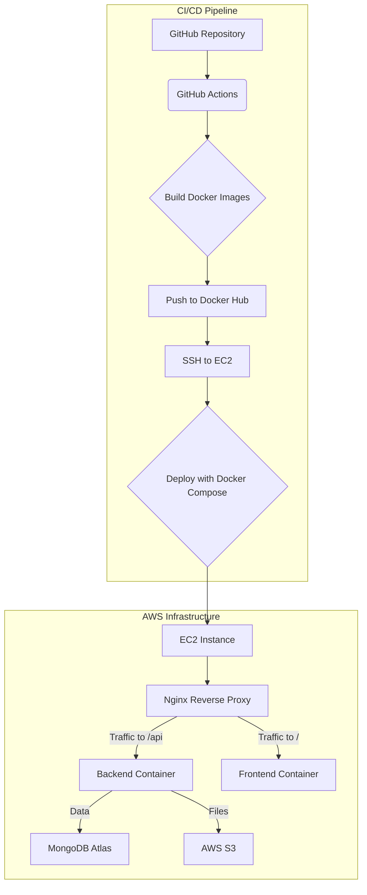

### **Deployment Plan for Blogify on AWS EC2**

#### **1. Architectural Overview**

The deployment architecture will consist of an AWS EC2 instance hosting our application. Nginx will act as a reverse proxy, directing traffic to the appropriate Docker containers for the frontend (React) and backend (Node.js). Docker Compose will orchestrate these services, ensuring they run together seamlessly. GitHub Actions will automate the build and deployment process upon every push to the main branch.



#### **2. AWS EC2 Instance Setup**

1.  **Launch EC2 Instance**:
    *   Choose an Amazon Machine Image (AMI) like `Ubuntu Server 22.04 LTS`.
    *   Select an instance type (e.g., `t2.medium` or `t3.medium` for a small application, scale up as needed).
    *   Configure a new Key Pair for SSH access. **Keep this private key secure.**

2.  **Security Group Configuration**:
    *   Create a new Security Group.
    *   **Inbound Rules**:
        *   SSH (Port 22): From your IP address (for initial setup and management).
        *   HTTP (Port 80): From Anywhere (for Nginx).
        *   HTTPS (Port 443): From Anywhere (for Nginx with SSL).

3.  **Install Docker and Docker Compose on EC2**:
    *   SSH into your EC2 instance:
        ```bash
        ssh -i /path/to/your-key.pem ubuntu@your-ec2-public-ip
        ```
    *   Update package lists:
        ```bash
        sudo apt update
        ```
    *   Install Docker:
        ```bash
        sudo apt install docker.io -y
        sudo systemctl start docker
        sudo systemctl enable docker
        sudo usermod -aG docker ubuntu # Add current user to docker group
        newgrp docker # Apply group changes immediately
        ```
    *   Install Docker Compose:
        ```bash
        sudo apt install docker-compose -y
        ```
    *   Verify installations:
        ```bash
        docker --version
        docker-compose --version
        ```

4.  **Set up SSH Access for GitHub Actions**:
    *   Generate a new SSH key pair on your local machine (or directly on EC2 if preferred, but local is safer for CI/CD):
        ```bash
        ssh-keygen -t rsa -b 4096 -C "github-actions-deploy" -f ~/.ssh/github_actions_deploy_key
        ```
    *   Copy the public key (`github_actions_deploy_key.pub`) to your EC2 instance's `~/.ssh/authorized_keys` file:
        ```bash
        cat ~/.ssh/github_actions_deploy_key.pub | ssh -i /path/to/your-key.pem ubuntu@your-ec2-public-ip "mkdir -p ~/.ssh && cat >> ~/.ssh/authorized_keys"
        ```
    *   **Add the private key (`github_actions_deploy_key`) to GitHub Secrets** (e.g., `EC2_SSH_PRIVATE_KEY`).

#### **3. Application Dockerfiles**

The existing Dockerfiles are well-structured. We will use them as-is.

*   **`api/Dockerfile`**:
    ```dockerfile
    # Use a smaller base image
    FROM node:18-alpine

    # Set working directory
    WORKDIR /app

    # Copy package.json and yarn.lock first
    COPY package*.json ./
    COPY yarn.lock ./

    # Install dependencies for production only
    RUN yarn install --production

    # Copy only necessary files (consider using a .dockerignore file to exclude unnecessary files)
    COPY . .

    # Remove unnecessary files
    RUN rm -rf /app/*.log

    # Expose port
    EXPOSE 4000

    # Start the application
    CMD ["node", "index.js"]
    ```

*   **`client/Dockerfile`**:
    ```dockerfile
    # blogify/client/Dockerfile
    FROM node:18-alpine AS build
    ARG VITE_API_BACKEND_URL
    ARG VITE_GOOGLE_CLIENT_ID


    WORKDIR /app
    COPY package*.json ./
    RUN yarn install
    COPY . .

    # Pass build arguments as environment variables for build time
    ENV VITE_API_BACKEND_URL=${VITE_API_BACKEND_URL}
    ENV VITE_GOOGLE_CLIENT_ID=${VITE_GOOGLE_CLIENT_ID}

    RUN yarn run build

    FROM nginx:alpine
    COPY --from=build /app/dist /usr/share/nginx/html
    EXPOSE 80
    CMD ["nginx", "-g", "daemon off;"]
    ```

#### **4. Production `docker-compose.yml`**

This file will define our services (client, api, nginx) and their dependencies. We'll use environment variables for sensitive information.

```yaml
version: '3.8'

services:
  client:
    image: yashrajx/blogify-client:latest
    restart: always
    environment:
      VITE_API_BACKEND_URL: ${VITE_API_BACKEND_URL}
      VITE_GOOGLE_CLIENT_ID: ${VITE_GOOGLE_CLIENT_ID}
    depends_on:
      - api

  api:
    image: yashrajx/blogify-api:latest
    restart: always
    environment:
      MONGODB_URI: ${MONGODB_URI}
      JWT_SECRET: ${JWT_SECRET}
      GOOGLE_CLIENT_ID: ${GOOGLE_CLIENT_ID}
      GOOGLE_CLIENT_SECRET: ${GOOGLE_CLIENT_SECRET}
      AWS_ACCESS_KEY_ID: ${AWS_ACCESS_KEY_ID}
      AWS_SECRET_ACCESS_KEY: ${AWS_SECRET_ACCESS_KEY}
      AWS_REGION: ${AWS_REGION}
      AWS_BUCKET_NAME: ${AWS_BUCKET_NAME}
      CORS_DOMAIN_URL: ${CORS_DOMAIN_URL}
    ports:
      - "4000:4000" # Expose API port for Nginx to access internally

  nginx:
    image: nginx:alpine
    restart: always
    ports:
      - "80:80"
      - "443:443"
    volumes:
      - ./nginx.conf:/etc/nginx/nginx.conf:ro
      - ./ssl:/etc/nginx/ssl:ro # For SSL certificates
    depends_on:
      - client
      - api
```

**Note**: On the EC2 instance, you will need to create a `.env` file in the same directory as `docker-compose.yml` with the actual environment variables:

```
# .env on EC2
MONGODB_URI=your_mongodb_uri
JWT_SECRET=your_jwt_secret
GOOGLE_CLIENT_ID=your_google_client_id
GOOGLE_CLIENT_SECRET=your_google_client_secret
AWS_ACCESS_KEY_ID=your_aws_access_key_id
AWS_SECRET_ACCESS_KEY=your_aws_secret_access_key
AWS_REGION=your_aws_region
AWS_BUCKET_NAME=your_aws_bucket_name
VITE_API_BACKEND_URL=https://blogify-app.work.gd/api
VITE_GOOGLE_CLIENT_ID=your_google_client_id
CORS_DOMAIN_URL=https://blogify-app.work.gd # This should match your frontend's public URL
```

#### **5. Nginx Configuration**

The existing `nginx.conf` is suitable. We will ensure the `server_name` matches your domain and that SSL certificates are properly configured.

*   **`nginx.conf`**:
    ```nginx
    events {
      worker_connections 1024;
    }

    http {
      server {
        listen 80;
        server_name blogify-app.work.gd www.blogify-app.work.gd;
        return 301 https://$host$request_uri; # Redirect HTTP to HTTPS
      }

      server {
        listen 443 ssl;
        server_name blogify-app.work.gd www.blogify-app.work.gd;

        ssl_certificate /etc/nginx/ssl/fullchain.pem; # Path to your fullchain certificate
        ssl_certificate_key /etc/nginx/ssl/privkey.pem; # Path to your private key

        location / {
          proxy_pass http://client:80; # Forward to client container
          proxy_set_header Host $host;
          proxy_set_header X-Real-IP $remote_addr;
          proxy_set_header X-Forwarded-For $proxy_add_x_forwarded_for;
          proxy_set_header X-Forwarded-Proto $scheme;
        }

        location /api {
          proxy_pass http://api:4000; # Forward to API container
          proxy_set_header Host $host;
          proxy_set_header X-Real-IP $remote_addr;
          proxy_set_header X-Forwarded-For $proxy_add_x_forwarded_for;
          proxy_set_header X-Forwarded-Proto $scheme;
        }
      }
    }
    ```

**SSL/TLS Setup (Let's Encrypt with Certbot)**:

On your EC2 instance, after Nginx is running on port 80, you can use Certbot to obtain and renew SSL certificates.

1.  Install Certbot:
    ```bash
    sudo snap install core; sudo snap refresh core
    sudo snap install --classic certbot
    sudo ln -s /snap/bin/certbot /usr/bin/certbot
    ```
2.  Obtain certificates (Nginx plugin will automatically configure Nginx):
    ```bash
    sudo certbot --nginx -d blogify-app.work.gd -d www.blogify-app.work.gd
    ```
    Follow the prompts. This will create the `fullchain.pem` and `privkey.pem` files in `/etc/letsencrypt/live/your-domain.com/`. You will then need to update the `nginx.conf` to point to these paths.
3.  Create the `ssl` directory in your project root on EC2 and symlink the certificates:
    ```bash
    mkdir -p ~/blogify/ssl
    sudo ln -s /etc/letsencrypt/live/blogify-app.work.gd/fullchain.pem ~/blogify/ssl/fullchain.pem
    sudo ln -s /etc/letsencrypt/live/blogify-app.work.gd/privkey.pem ~/blogify/ssl/privkey.pem
    ```
    Ensure the `nginx` user has read access to these files.

#### **6. GitHub Actions CI/CD Workflow**

This workflow will build Docker images, push them to Docker Hub, and then deploy them to the EC2 instance.

*   **`.github/workflows/deploy.yml`**:
    ```yaml
    name: Deploy to EC2

    on:
      push:
        branches:
          - main # Trigger on pushes to the main branch

    env:
      DOCKER_HUB_USERNAME: yashrajx
      EC2_HOST: your-ec2-public-ip-or-dns # Replace with your EC2 Public IP or DNS
      EC2_USER: ubuntu # Or ec2-user, depending on your AMI

    jobs:
      deploy:
        runs-on: ubuntu-latest
        environment: production # Optional: Define an environment for better secret management

        steps:
          - name: Checkout code
            uses: actions/checkout@v4

          - name: Login to Docker Hub
            uses: docker/login-action@v3
            with:
              username: ${{ env.DOCKER_HUB_USERNAME }}
              password: ${{ secrets.DOCKER_HUB_TOKEN }} # Store Docker Hub Access Token as a GitHub Secret

          - name: Build and push API Docker image
            run: |
              docker build -t ${{ env.DOCKER_HUB_USERNAME }}/blogify-api:latest ./api
              docker push ${{ env.DOCKER_HUB_USERNAME }}/blogify-api:latest

          - name: Build and push Client Docker image
            run: |
              docker build -t ${{ env.DOCKER_HUB_USERNAME }}/blogify-client:latest ./client \
                --build-arg VITE_API_BACKEND_URL=${{ secrets.VITE_API_BACKEND_URL }} \
                --build-arg VITE_GOOGLE_CLIENT_ID=${{ secrets.VITE_GOOGLE_CLIENT_ID }}
              docker push ${{ env.DOCKER_HUB_USERNAME }}/blogify-client:latest

          - name: Deploy to EC2
            uses: appleboy/ssh-action@master
            with:
              host: ${{ env.EC2_HOST }}
              username: ${{ env.EC2_USER }}
              key: ${{ secrets.EC2_SSH_PRIVATE_KEY }} # Store EC2 SSH Private Key as a GitHub Secret
              script: |
                cd /home/${{ env.EC2_USER }}/blogify # Navigate to your project directory on EC2
                # Create/update .env file on EC2 with production environment variables
                echo "MONGODB_URI=${{ secrets.MONGODB_URI }}" > .env
                echo "JWT_SECRET=${{ secrets.JWT_SECRET }}" >> .env
                echo "GOOGLE_CLIENT_ID=${{ secrets.GOOGLE_CLIENT_ID }}" >> .env
                echo "GOOGLE_CLIENT_SECRET=${{ secrets.GOOGLE_CLIENT_SECRET }}" >> .env
                echo "AWS_ACCESS_KEY_ID=${{ secrets.AWS_ACCESS_KEY_ID }}" >> .env
                echo "AWS_SECRET_ACCESS_KEY=${{ secrets.AWS_SECRET_ACCESS_KEY }}" >> .env
                echo "AWS_REGION=${{ secrets.AWS_REGION }}" >> .env
                echo "AWS_BUCKET_NAME=${{ secrets.AWS_BUCKET_NAME }}" >> .env
                echo "VITE_API_BACKEND_URL=${{ secrets.VITE_API_BACKEND_URL }}" >> .env
                echo "VITE_GOOGLE_CLIENT_ID=${{ secrets.VITE_GOOGLE_CLIENT_ID }}" >> .env
                echo "CORS_DOMAIN_URL=${{ secrets.CORS_DOMAIN_URL }}" >> .env
                # Pull latest images and restart services
                docker-compose -f docker-compose.yml pull
                docker-compose -f docker-compose.yml up -d --build --remove-orphans
                docker system prune -f # Clean up old images/containers
    ```

**GitHub Secrets Management**:

You will need to add the following secrets to your GitHub repository settings (`Settings > Secrets and variables > Actions > New repository secret`):

*   `DOCKER_HUB_TOKEN`: Your Docker Hub access token (generate from Docker Hub settings).
*   `EC2_SSH_PRIVATE_KEY`: The private SSH key generated for GitHub Actions (the content of `~/.ssh/github_actions_deploy_key`).
*   `MONGODB_URI`: Your MongoDB Atlas connection string.
*   `JWT_SECRET`: A strong secret key for JWT.
*   `GOOGLE_CLIENT_ID`: Your Google OAuth client ID.
*   `GOOGLE_CLIENT_SECRET`: Your Google OAuth client secret.
*   `AWS_ACCESS_KEY_ID`: Your AWS Access Key ID for S3.
*   `AWS_SECRET_ACCESS_KEY`: Your AWS Secret Access Key for S3.
*   `AWS_REGION`: The AWS region where your S3 bucket is located (e.g., `us-east-1`).
*   `AWS_BUCKET_NAME`: The name of your AWS S3 bucket.
*   `VITE_API_BACKEND_URL`: The public URL of your API (e.g., `https://your-domain.com/api`).
*   `VITE_GOOGLE_CLIENT_ID`: Your Google OAuth client ID (for the frontend).
*   `CORS_DOMAIN_URL`: The public URL of your frontend (e.g., `https://your-domain.com`).

#### **7. Security Considerations**

*   **SSH Key Management**: Use dedicated SSH keys for CI/CD and restrict their permissions. Store private keys securely in GitHub Secrets.
*   **Environment Variables/Secrets**: Never hardcode sensitive information. Use GitHub Secrets for CI/CD and `.env` files on the EC2 instance.
*   **Security Groups**: Restrict inbound traffic to only necessary ports (22, 80, 443) and specific IP ranges where possible.
*   **SSL/TLS**: Always use HTTPS for all traffic to encrypt data in transit. Implement strong SSL/TLS configurations.
*   **Docker Security**: Regularly update Docker images to their latest versions to patch vulnerabilities. Use minimal base images (like `alpine`).
*   **AWS Credentials**: Securely manage your AWS Access Key ID and Secret Access Key. Consider using IAM roles for EC2 instances if your application directly accesses AWS services from the instance, rather than storing credentials as environment variables.
*   **Least Privilege**: Ensure your EC2 instance's IAM role has only the necessary permissions if interacting with other AWS services (e.g., S3).
*   **Regular Updates**: Keep the EC2 operating system and installed software (Docker, Docker Compose) up to date.

#### **8. Scalability and Maintainability**

*   **Scalability**:
    *   **EC2 Instance Type**: Easily scale up the EC2 instance type (e.g., from `t2.medium` to `t2.large`) as traffic increases.
    *   **Load Balancing**: For higher availability and scalability, consider placing the EC2 instance behind an AWS Application Load Balancer (ALB) and using an Auto Scaling Group to automatically adjust the number of instances based on demand. This is also key for true zero-downtime deployments (e.g., blue/green deployments).
    *   **Zero-Downtime Deployments**: While `docker-compose up -d` minimizes downtime by replacing containers, for true zero-downtime, consider strategies like:
        *   **Blue/Green Deployments**: Deploy a new version (Green) alongside the old (Blue). Once Green is healthy, switch traffic to Green and decommission Blue. This requires a load balancer.
        *   **Rolling Updates**: Gradually replace old containers with new ones. Docker Swarm or Kubernetes provide built-in support for this. For a single EC2 instance with Docker Compose, this is less straightforward but can be achieved with careful scripting.
    *   **Database**: MongoDB Atlas is a managed service and scales independently.
    *   **S3**: AWS S3 is highly scalable for file storage.
*   **Maintainability**:
    *   **Containerization**: Docker and Docker Compose provide a consistent environment, simplifying development and deployment.
    *   **CI/CD**: GitHub Actions automates the deployment process, reducing manual errors and ensuring consistent deployments.
    *   **Monitoring**: Implement monitoring tools (e.g., AWS CloudWatch, Prometheus/Grafana) to track application performance and health.
    *   **Logging**: Centralize logs from Docker containers for easier debugging and analysis.
    *   **Version Control**: All configurations (Dockerfiles, docker-compose.yml, Nginx config, GitHub Actions) are version-controlled in Git.

#### **9. Conclusion**

This comprehensive deployment plan provides a robust and automated solution for deploying the Blogify application to AWS EC2 using Nginx, Docker, and Docker Compose, integrated with a GitHub Actions CI/CD pipeline. By following these steps and adhering to best practices, you can ensure a scalable, secure, and maintainable deployment.