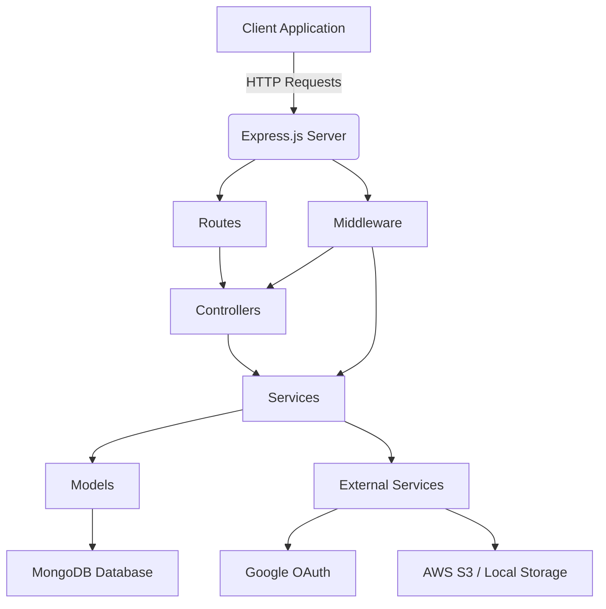
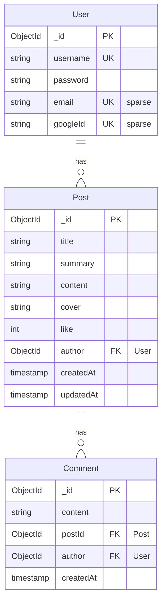
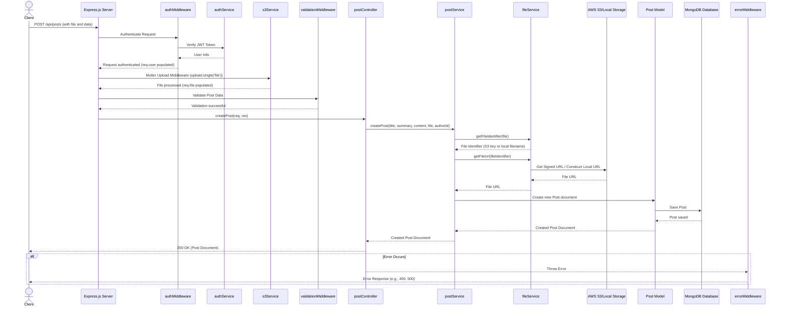

# Backend Architecture of the Blogging Application

This document outlines the architecture of the Node.js backend for the blogging application. The backend is built using Express.js, interacts with a MongoDB database, and integrates with external services for authentication (Google OAuth) and file storage (AWS S3 or local disk).

## 1. High-Level Architecture

The backend follows a layered architecture, separating concerns into routes, controllers, services, and models. It uses middleware for cross-cutting concerns like authentication, validation, and error handling.

## 2. Core Components and Their Responsibilities

### `api/index.js`
This is the main entry point of the application. It initializes the Express.js server, connects to the MongoDB database, sets up global middleware (CORS, JSON parsing, cookie parsing, logging), and registers the API routes. It also includes a static route for serving uploaded files locally if S3 is not used.

### `api/config/db.js`
Handles the connection to the MongoDB database using Mongoose. It exports a `connectDB` function that establishes the connection based on the `MONGO_URI` environment variable.

### `api/routes/`
Defines the API endpoints and maps them to specific controller functions.
*   **`authRoutes.js`**: Manages user authentication.
    *   `POST /api/auth/register`: User registration.
    *   `POST /api/auth/login`: User login.
    *   `GET /api/auth/profile`: Retrieves user profile (protected).
    *   `POST /api/auth/logout`: User logout.
    *   `POST /api/auth/google`: Google OAuth login.
*   **`postRoutes.js`**: Manages blog posts and comments.
    *   `POST /api/posts`: Creates a new post (protected, handles file upload).
    *   `PUT /api/posts/:postId`: Updates an existing post (protected, handles file upload).
    *   `GET /api/posts/search`: Searches for posts.
    *   `GET /api/posts`: Retrieves all posts.
    *   `GET /api/posts/user/:userId`: Retrieves posts by a specific user.
    *   `GET /api/posts/:id`: Retrieves a single post by ID.
    *   `GET /api/posts/:postId/comments`: Retrieves comments for a post.
    *   `POST /api/posts/:postId/comments`: Adds a comment to a post (protected).
    *   `POST /api/posts/:postId/likestatus`: Updates post like status.
    *   `DELETE /api/posts/:postId`: Deletes a post (protected).
    *   `DELETE /api/comments/:commentId`: Deletes a comment (protected).

### `api/controllers/`
These modules contain the request handling logic. They receive requests from routes, perform input validation (delegating to `validationMiddleware`), call appropriate service functions to execute business logic, and send back HTTP responses.
*   **`authController.js`**: Handles user registration, login, profile retrieval, and logout.
*   **`commentController.js`**: Manages operations related to comments (getting, adding, deleting).
*   **`postController.js`**: Manages operations related to posts (creating, updating, retrieving, deleting, liking, searching).

### `api/services/`
These modules encapsulate the core business logic of the application. They interact with Mongoose models to perform database operations and integrate with external services.
*   **`authService.js`**: Contains logic for user registration, password hashing, JWT token generation and verification, and Google OAuth integration.
*   **`commentService.js`**: Handles the business logic for comments, including fetching comments for a post, adding new comments, and deleting comments.
*   **`fileService.js`**: Provides an abstraction layer for file storage. It determines whether to use AWS S3 or local disk storage based on environment variables and handles file uploads, deletions, and URL generation.
*   **`postService.js`**: Contains the business logic for managing posts, including creation, updates, retrieval (all, by user, by ID), liking, searching, and deletion. It also interacts with `fileService` for cover image management.

### `api/models/`
These modules define the Mongoose schemas, which represent the structure of documents within the MongoDB collections.
*   **`User.js`**: Defines the schema for user documents, including `username`, `password`, `email` (optional, for Google OAuth), and `googleId` (optional, for Google OAuth).
*   **`Post.js`**: Defines the schema for blog post documents, including `title`, `summary`, `content`, `cover` (image URL), `like` count, and a reference to the `author` (User model).
*   **`Comment.js`**: Defines the schema for comment documents, including `content`, a reference to the `postId` (Post model), and a reference to the `author` (User model).

### `api/middlewares/`
These are functions that execute during the request-response cycle.
*   **`authMiddleware.js`**: Verifies the JWT token from cookies for protected routes and attaches user information to the request object (`req.user`).
*   **`errorMiddleware.js`**: A centralized error handling middleware that catches errors thrown by other parts of the application and sends appropriate HTTP error responses (e.g., 400 for validation errors, 404 for not found, 500 for internal server errors). It uses custom error classes defined in `api/utils/errors.js`.
*   **`validationMiddleware.js`**: A generic middleware that uses Joi schemas to validate incoming request bodies. If validation fails, it throws a `ValidationError`.

### `api/external/`
This directory contains modules for integrating with third-party services.
*   **`googleAuthService.js`**: Handles the verification of Google ID tokens and the logic for finding or creating users based on Google account information. It uses the `google-auth-library` package.
*   **`s3Service.js`**: Configures and exports the AWS S3 client and Multer middleware. It dynamically switches between `multer-s3` (for S3 uploads) and `multer.diskStorage` (for local uploads) based on the presence of AWS environment variables.

### `api/utils/errors.js`
Defines custom error classes (`ApiError`, `AuthError`, `ValidationError`, `NotFoundError`) to provide more structured and specific error handling throughout the application.

### `api/validations/`
Contains Joi schemas used by `validationMiddleware` to validate incoming request data.
*   **`authValidation.js`**: Joi schemas for user registration and login input validation.
*   **`postValidation.js`**: Joi schema for post creation and update input validation.

## 3. Request Flow Example: Creating a New Post

This sequence diagram illustrates the flow of a request to create a new blog post, including file upload and authentication.

## 4. File Storage Mechanism

The application supports two modes for storing cover images:
1.  **AWS S3**: If `AWS_ACCESS_KEY_ID`, `AWS_SECRET_ACCESS_KEY`, `AWS_BUCKET_NAME`, and `AWS_REGION` environment variables are configured, the application uses AWS S3 for file storage. `multer-s3` is used with Multer to directly upload files to S3.
2.  **Local Disk Storage**: If AWS credentials are not provided, the application falls back to storing files locally in the `api/uploads` directory. `multer.diskStorage` is used for this purpose.

The `api/services/fileService.js` module abstracts this complexity, providing a unified interface (`getFileIdentifier`, `deleteFile`, `getFileUrl`) regardless of the underlying storage mechanism. This makes the application flexible and easy to deploy in different environments.